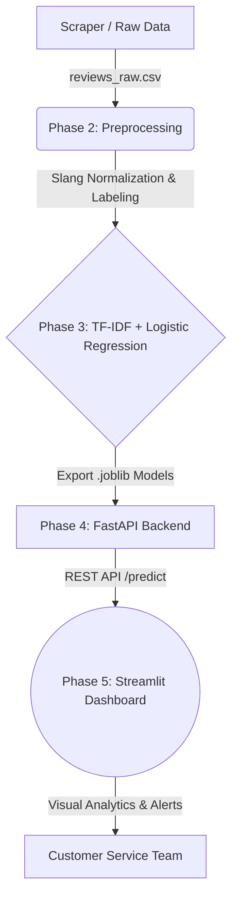

# 🛍️ End-to-End Local E-Commerce Review Categorizer

## Business Problem & Impact
Local e-commerce businesses often receive hundreds of reviews across various platforms. Manually reading and categorizing these reviews to find specific actionable complaints (e.g., "was the packaging bad?", "was the courier slow?", "is the product defective?") is incredibly time-consuming. 

This project solves that problem by providing an automated Machine Learning pipeline tailored specifically for **Indonesian text and e-commerce slang**. It automatically predicts the Sentiment (Positive/Negative) and categorizes the exact Aspect of the complaint (Shipping, Product Quality, Customer Service, Packaging), allowing customer service teams to immediately triage high-priority negative reviews.

## 🏗️ Architecture Flowchart



## 🚀 Live Interactive Demo
*(When deployed to Hugging Face Spaces or Streamlit Cloud, insert your live URL here: `https://huggingface.co/spaces/your-username/ecommerce-reviews`)*

## 📂 Project Structure
```text
├── data/
│   ├── raw/reviews_raw.csv                 # Generated/Scraped raw reviews
│   └── processed/reviews_cleaned.csv       # Cleaned, labeled, and slang-normalized
├── models/                                 # Serialized ML artifacts (.joblib)
├── notebooks/
│   ├── 01_scraping.py                      # Playwright scraper / Synthetic data generator
│   ├── 02_eda_and_preprocessing.py         # Text cleaning and splitting
│   └── 03_model_training.py                # Scikit-Learn TF-IDF and Model Training
├── app/
│   ├── main.py                             # FastAPI server
│   └── model_utils.py                      # Model loading and inference pipeline
├── streamlit_app.py                        # Streamlit Interactive Dashboard
└── requirements.txt                        # Project dependencies
```

## ⚙️ How to Run Locally

### 1. Setup Environment
Ensure you have Python 3.9+ installed.
```bash
pip install -r requirements.txt
```

### 2. Generate Data & Train Models
Run the notebooks/scripts in order:
```bash
python notebooks/01_scraping.py
python notebooks/02_eda_and_preprocessing.py
python notebooks/03_model_training.py
```

### 3. Start the FastAPI Backend
In a new terminal window, start the inference server:
```bash
uvicorn app.main:app --reload
```
Check the API documentation at `http://127.0.0.1:8000/docs`

### 4. Launch the Streamlit Dashboard
In another terminal window, launch the UI:
```bash
streamlit run streamlit_app.py
```
This will open the beautiful dashboard in your browser!
